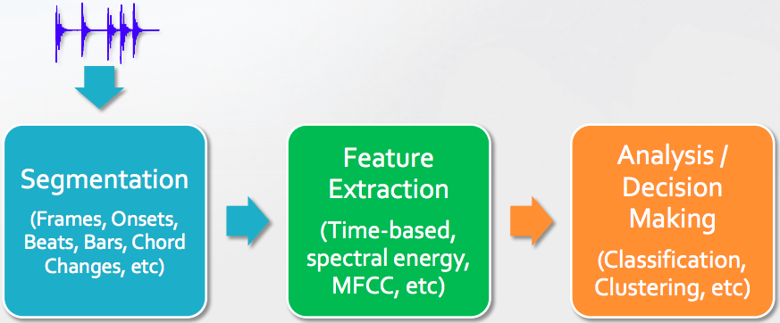

# Background
## Music information retrieval (MIR)
MIR is an interdisciplinary research that lies on the edges of musicology, psychology, signal processing, and machine learning. ISMIR (International Symposium on Music Information Retrieval) and MIREX (Music Information Retrieval Evaluation eXchange) are the two important conference of MIR. Applications of MIR can be listed as follows:

- Music recommendation and annotation
- Automatic classification of genre, mood, artists, etc.
- Automatic music transcription
- Music generation

In our project, we focus on learning to rank the performance of vocal singing.

Basic of a MIR system, including segmentation, feature extraction, analysis is represented as in the figure below.

## Feature representation
Music analysis often requires some summarising and is achieved by feature extraction, especially when the audio content is analysed and machine learning is to be applied. The purpose is to reduce the sheer quantity of data down to a manageable set of values so that learning can be performed within a reasonable time-frame. One common feature extracted is the Mel-Frequency Cepstral Coefficient (MFCC).
### Mel-Frequency Cepstral Coefficient (MFCC) 
MFCC is a measure of the timbre of a piece of music, representing the short-term power spectrum of a sound, based on a linear cosine transform of a log power spectrum on a nonlinear mel scale of frequency. MFCCs are commonly derived as follows:

- Take the Fourier transform of (a windowed excerpt of) a signal.
- Map the powers of the spectrum obtained above onto the mel scale, using triangular overlapping windows.
- Take the logs of the powers at each of the mel frequencies.
- Take the discrete cosine transform of the list of mel log powers, as if it were a signal.

MFCCs are increasingly finding uses in music information retrieval applications such as genre classification, audio similarity measures, etc. However, MFCC values are not very robust in the presence of additive noise
## Other features
Other musical features, such as key, chords, harmonies, melody, main pitch, beats per minute or rhythm in the piece, etc. can be calculated based on low-level feature such MFCC, spectral roll-off frequency, band energy ratio, delta spectrum magnitude, etc.
There is a number of tools available to automatically extract acoustic features from audio signal. We represent these tools in 2.2.
# Automatic Evaluation of Karaoke Singing
Karaoke is a popular form of singing entertainment, rooted from Japan. Many of nowaday karaoke systems have a scoring feature to evaluate singers’ performance. However, these rating is poorly constructed and not matched with human rating. Our project aims to provide an automatic evaluation based on appropriate acoustic features, extracted from the vocal signal of singers. Though speech processing is a very developed field of studies and techonologies, its approach is not suitable for singing voice because singing voice differs from speech in its intensity and dynamic range and because singing voice usually comes with a non stationary background music signal.

As we know, MIR can perform the tasks of labeling songs based on genre, mood, artists, etc. In this project, we focus on the vocal quality of the singing and train the machine to distinguish between good and poor singing. This can be done by recalling features of the singing, such as enthusiasm, emotion, pitch, volume, rythm, melodic similarity measures, etc.
## Music perception
Human can easily distinguish between music and noise. Phisically, music is ordered and patterned sound waves, produced by harmonic vibrations from the source. The major attibutes of music are as follows:

- The pitch value is determined by the wavelength of the sound signal. High-pitched tones have short wavelengths, while low-pitched tones have long wavelengths.
- Intensity, or loudness is to the magnitude of acoustic waves. High-magnitude sound carries more energy than low-magnitude sound.
- Duration refers to the amount of time in which a musical note sustain.
- Timbre refers to different harmonics, created by different source, e.g. piano vs. violin. 
## Feature extraction
To evaluate a piece of singing, we would like to combine both the score-based and machine-learned ranking methods. We first identify the perception which makes a piece of singing good or bad; it can be the enthusiasm of singers, which is mostly represented by intensity of the singings, or it can be the pitch interval, the vibrato, etc., or both. Then, we then link this perception to appropriate acoustic features. Alternatively, we can do a feature importance analysis among these acoustic features.

There are many features that can be extracted from music signal. These features can be categorized into: reference features, content-based features and text-based features. Reference features can be those relating to social interactions, e.g. followers, performance rating in, for example, soundcloud. Text-based features includes lyrics, interview, etc. Our approach will be based on content-based features, extracted from the wave signal, e.g. pitch, rythm, etc. and we might use reference features as ground truth for our machine-learned ranking method. 

The content-based features are calculated from low-level signal features (sometime refered as extraction methods), the most important of which is MFCC. MFCC and its derived features (such as ‘anchor space’[1]) have been shown to give good performance for a variety of audio classification tasks. MFCCs capture the short-time spectral shape, which carries information about instrumental timbres or the quality of a singing. Yet, they do not capture long-term information such as melody, rhythm, etc. A study comparing audio feature extraction methods is conducted in [2].
In this project, we do the feature extraction based on available toolboxes instead of doing low-level signal processing and transform (FFT, Wavelet, etc.). Some of toolboxes which could be used are described as follows:

- Aubio: A library that extracts high level features such as beat tracking, tempo, melody.
- Timbre Toolbox: A Matlab toolbox for high and low level feature extraction, providing different set of features to the MIR Toolbox, specifically made efficient for identifying timbre.
- YAAFE: A library for Low level feature extraction, designed for computational efficiency and batch processing, written in C++ with a CLI and bindings for Python and Matlab.
- pyAudioAnalysis: An open Python library that provides a wide range of audio-related functionalities focusing on feature extraction, classification, segmentation and visualization issues.
- The Echo Nest Analyze API: An online system which can receive a song sent by users, analyze the acoustics and provide features to characterize global properties of the songs.

There are other tools, many of which are available to be evaluated in [2].
## Datasets
## Related work
Music similarity metrics is a research aiming to calculate the similarity between songs or artists, comparing their performance. In [1], authors employ a feature, derived from MFCC, called 'anchor space', which uses musical categories and well-known anchor artists as convenient reference points for describing features of the music. It is inspired by a fold wisdom such as "Jeff Buckley sounds like Van Morrison meets Led Zeppelin, but more folky." Other approaches for song similarity are to embed songs into a Euclidian metric space and do some distance-based analysis and clustering [3].

For evaluation of karaoke singing, there is an approach based on the perception of singing enthusiasm [4]. The authors argue that karaoke is the form of entertainment for amateur so enthusiasm is a good criteria to evaluate them. They identified three acoustic features relevant to such perception: A weighted power, “fall-down”, and vibrato extent, developed a system for evaluating singing enthusiasm, and obtained a correlation coefficient of 0.65 between the system output and human evaluation. In our point of view, their method can be considered as score-based ranking. In [5], the authors proposed a score combination from pitch-based, volume-based, and rhythm-based rating, with a reference specified karaoke song to evaluate a piece of singing. This approach is also score-based ranking. In [6], the authors used HMM as a statistical music recognition model for automatic scoring of karaoke computer games. The musical features they employed are Pitch & Pitch Error, Accent, Zero-Crossing Rate, Root-Mean-Squared Energy.

Another effort for analyzing the singing voice is made in [7], in which the authors reported good results of a system for classifying “good” and “poor” singing based on SVM. In [8], the authors proposed a categorization and segmentation system for singing voice expression using pre-defined rules and HMM. There is another approach for automatic scoring of singing voice based on melodic similarity measures [9]. In [10], a method of evaluating singing skills that does not require score information is represented. The authors used pitch interval accuracy and vibrato as acoustic features to evaluate singing. The approach was then tested by a 2-class (good/poor) classification test with 600 song sequences, and achieved an average classification rate of 83.5%. There is an approach for song classification based on perception of emtion [11].
## Method and Model
Our workflow would be as follows. First, we will separate the vocal and non-vocal segments of song. Then, we extract the acoustic features from the singing part. Next, we will build our model based Metric Learning to Rank [12] to automatically learn the distance metric, rather than embed our songs in a Euclidian metric space. This distance metric that have been learned will then be used in a learning to rank algorithm, based on Structural SVM. In [12], the authors derived a general metric learning algorithm which optimizes the permutation of data, which is the output of a learning to rank algorithm, induced by distances in the learned metric. In other words, they proposed a metric learning algorithm optimized for rank-based loss function.
# References
- [1] Berenzweig, Adam, et al. "A large-scale evaluation of acoustic and subjective music-similarity measures." Computer Music Journal 28.2 (2004): 63-76.
- [2] Moffat, David, David Ronan, and Joshua D. Reiss. "An evaluation of audio feature extraction toolboxes." (2015).
- [3] Slaney, Malcolm, Kilian Weinberger, and William White. "Learning a metric for music similarity." International Symposium on Music Information Retrieval (ISMIR). 2008.
- [4] Daido, Ryunosuke, et al. "A System for Evaluating Singing Enthusiasm for Karaoke." ISMIR. 2011.
- [5] Tsai, Wei-Ho, and Hsin-Chieh Lee. "Automatic evaluation of karaoke singing based on pitch, volume, and rhythm features." IEEE Transactions on Audio, Speech, and Language Processing 20.4 (2012): 1233-1243.
- [6] Qiu, Dongping. "Development of Scoring Algorithm for Karaoke Computer Games." (2012).
- [7] Nakano, Tomoyasu, Masataka Goto, and Yuzuru Hiraga. "An automatic singing skill evaluation method for unknown melodies using pitch interval accuracy and vibrato features." Ninth International Conference on Spoken Language Processing. 2006.
- [8] Mayor, Oscar, Jordi Bonada, and Alex Loscos. "The singing tutor: Expression categorization and segmentation of the singing voice." Proceedings of the AES 121st Convention. 2006.
- [9] Molina, Emilio, E. Gómez, and I. Barbancho. "Automatic scoring of singing voice based on melodic similarity measures." Master's thesis, Universitat Pompeu Fabra, Barcelona, Spain (2012): 9-14.
- [10] Nakano, Tomoyasu, Masataka Goto, and Yuzuru Hiraga. "An automatic singing skill evaluation method for unknown melodies using pitch interval accuracy and vibrato features." Ninth International Conference on Spoken Language Processing. 2006.
- [11] Eyben, Florian, et al. "Emotion in the singing voice—a deeperlook at acoustic features in the light ofautomatic classification." EURASIP Journal on Audio, Speech, and Music Processing 2015.1 (2015): 1-9.
- [12] McFee, Brian, and Gert R. Lanckriet. "Metric learning to rank." Proceedings of the 27th International Conference on Machine Learning (ICML-10). 2010.
